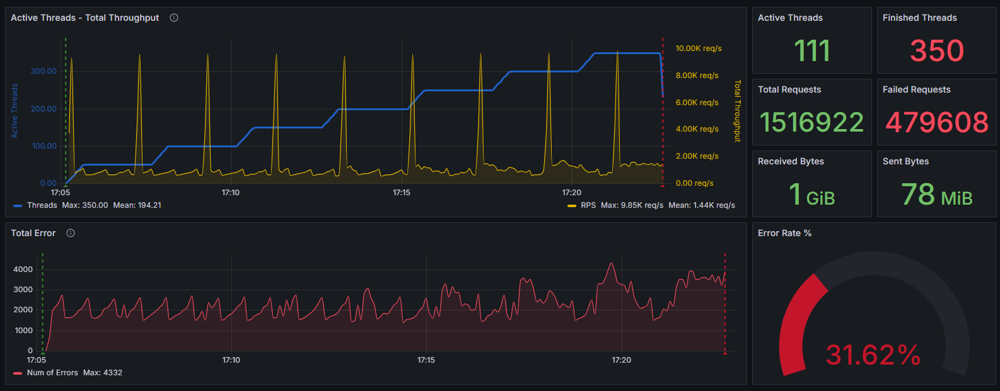
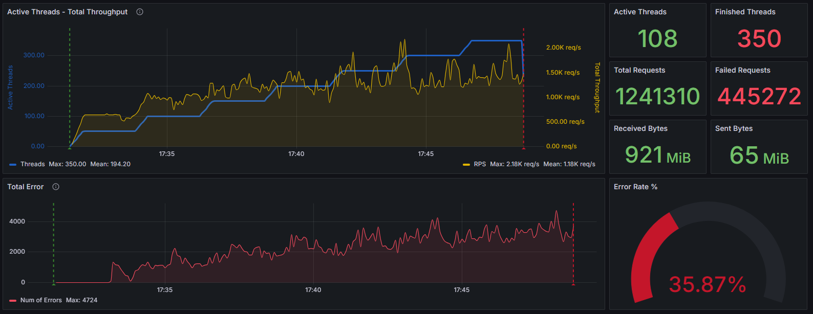

# Заметки

В ходе выполнения задания возникали следующие проблемы.
Вначале не знал как в JMeter добавить POST запрос. Проблема решена с помощью приложение Fiddler Classic.
Сделал POST запрос в Postman. Отловил пакет в Fiddler Classic. Перенес в JMeter настройки в HTTP Request.

### Что выполнил:

- На java написал заглушку. Использовал Spring Framework.
- Познакомился с приложением Fiddler Classic.
- Написал коллекцию в Postman с двумя методами GET и POST.
- B Grafana использовал дашборд <https://grafana.com/grafana/dashboards/21818-jmeter-dashboard-influxdb/>

### В JMeter

- Использовал JSON Assertion для проверки ответа на GET и POST запросы.
- Отправка метрик осуществляется с помощью **Backend listener** в InfluxDB.

### Графики тестов

 \
*Скриншот со ступенчатым тестом без задержек в методах заглушки*

 \
*Скриншот со ступенчатым тестом с задержкой в 2 секунды на метод POST*

 \
*Скриншот со ступенчатым тестом с Constant Timer в 0,3 секунды на метод GET*

 \
*Скриншот со ступенчатым тестом с Constant Timer в 2 секунды на метод POST*
