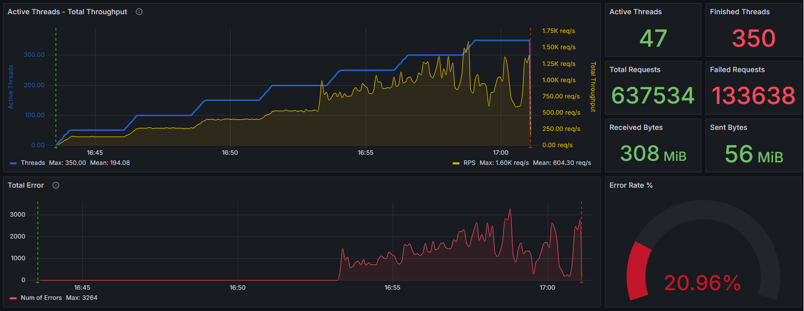
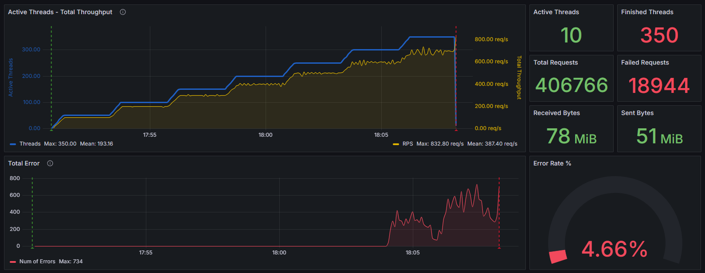

# Заметки

В ходе выполнения задания возникали следующие проблемы.
Вначале не знал как в JMeter добавить POST запрос. Проблема решена с помощью приложение Fiddler Classic.
Сделал POST запрос в Postman. Отловил пакет в Fiddler Classic. Перенес в JMeter настройки в HTTP Request.

### Что выполнил:

- На java написал заглушку. Использовал Spring Framework.
- Познакомился с приложением Fiddler Classic.
- Написал коллекцию в Postman с двумя методами GET и POST.
- B Grafana использовал дашборд <https://grafana.com/grafana/dashboards/21818-jmeter-dashboard-influxdb/>

### В JMeter

- Использовал JSON Assertion для проверки ответа на GET и POST запросы.
- Отправка метрик осуществляется с помощью **Backend listener** в InfluxDB.

### Графики тестов

Далее идут графики со ступенчатыми тестами при настройках JVM по умолчанию. В JVM по умолчанию запустился сборщик мусора G1. С помощью параметра `-Xlog:gc` можно вывести логи, связанные с работой сборщика мусора. Для более тонкой настройки можно использовать различные параметры, например:

- `Xlog:gc:file=gc.log` — направляет логи в файл gc.log.
- `Xlog:gc=debug` — устанавливает уровень детализации логов на debug.

 \
*Скриншот со ступенчатым тестом без задержек в методах заглушки*

 \
*Скриншот со ступенчатым тестом с задержкой в 2 секунды на метод POST*

 \
*Скриншот со ступенчатым тестом с Constant Timer в 0,3 секунды на метод GET*

 \
*Скриншот со ступенчатым тестом с Constant Timer в 2 секунды на метод POST*

В JVM можно использовать различные настройки для управления сборщиком мусора (GC). Вот некоторые из наиболее часто используемых параметров:

1. **Выбор алгоритма GC:**
   - `-XX:+UseSerialGC` — использование серийного сборщика мусора (подходит для однопоточных приложений).
   - `-XX:+UseParallelGC` — использование параллельного сборщика мусора (подходит для многопоточных приложений).
   - `-XX:+UseConcMarkSweepGC` (CMS) — использование сборщика мусора Concurrent Mark-Sweep.
   - `-XX:+UseG1GC` — использование сборщика мусора Garbage-First (G1), который является более современным и эффективным для большинства приложений.

2. **Настройка размеров памяти:**
   - `-Xms<size>` — начальный размер кучи. Например, `-Xms1g` установит начальный размер кучи в 1 ГБ.
   - `-Xmx<size>` — максимальный размер кучи. Например, `-Xmx4g` установит максимальный размер кучи в 4 ГБ.
   - `-XX:NewSize=<size>` — размер молодого поколения.
   - `-XX:MaxNewSize=<size>` — максимальный размер молодого поколения.

3. **Настройка параметров GC:**
   - `-XX:SurvivorRatio=<ratio>` — соотношение размеров областей Eden и Survivor.
   - `-XX:MaxTenuringThreshold=<threshold>` — максимальное количество повышений уровня перед перемещением объекта в старое поколение.
   - `-XX:ParallelGCThreads=<N>` — количество потоков, используемых параллельным сборщиком мусора.

4. **Включение дополнительных функций:**
   - `-XX:+PrintGC` — печать информации о сборке мусора.
   - `-XX:+PrintGCDetails` — более детальная печать информации о сборке мусора.
   - `-XX:+PrintHeapAtGC` — печать состояния кучи перед и после сборки мусора.
   - `-XX:+PrintTenuringDistribution` — печать информации о распределении возраста объектов.

5. **Настройки для G1 GC:**
   - `-XX:MaxGCPauseMillis=<N>` — указание максимальной паузы GC, которую нужно стараться не превышать.
   - `-XX:InitiatingHeapOccupancyPercent=<N>` — процент заполнения кучи, при достижении которого начинается цикл GC.
