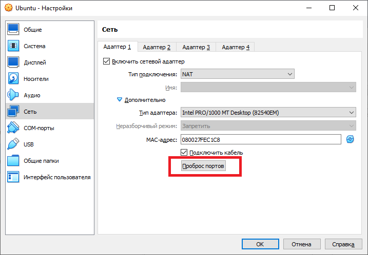
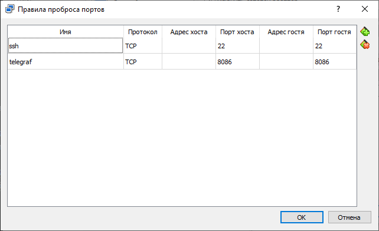
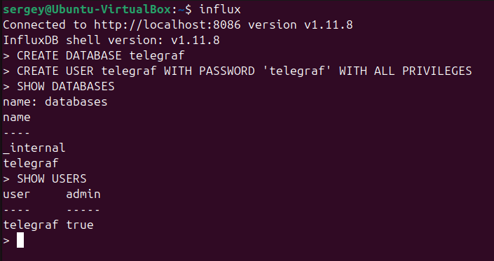
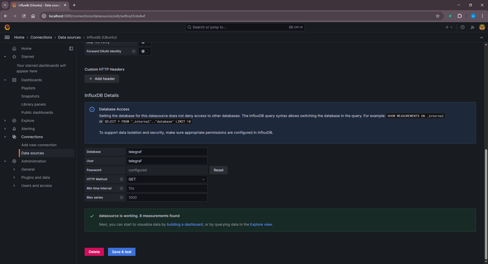
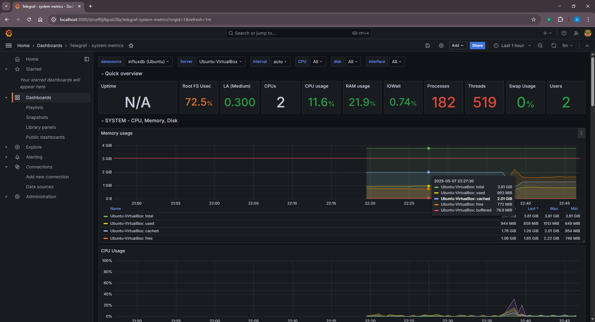

# Part 1 Виртуальная машина

## Создание виртуальной машины

В программе **Oracle VM VirtualBox** создадим виртуальную машину со следующими параметрами:

- Имя: Ubuntu
- Тип: Linux
- Процессор: 2 ядра
- Жесткий диск: 16 ГБ
- Сеть:
  - Адаптер 1:
    - Тип подключения: NAT
    - Проброс портов TCP 22 <-> 22, TCP 8086 <-> 8086
  - Адаптер 2:
    - Тип подключения: Сетевой мост

 \
*Скриншот с настройками сети в виртуальной машине*

 \
*Скриншот с настройками пробросом портов виртуальной машине*

## Установка и настройка InfluxDB

Необходимо установить **influxdb** и **influxdb client**. Для этого используем команду `sudo apt install influxdb influxdb-client`.

Разблокировать службу **influxdb** можно с помощью команды `sudo systemctl unmask influxdb.service`.
Запустим службу **influxdb** командой `sudo systemctl start influxdb.service`. 
Командой `sudo systemctl status influxdb.service` проверим статус демона.

Запустим influx CLI командой `influx`.

Перечень команд, которые могут понадобиться при работе с **InfluxDb** приведен ниже в таблице.

| Команда                                                      | Назначение                                                           |
|--------------------------------------------------------------|----------------------------------------------------------------------|
| SHOW DATABASES                                               | Показать список баз данных                                           |
| SHOW USERS                                                   | Показать список пользователей                                        |
| CREATE DATABASE telegraf                                     | Создает базу данных telegraf                                         |
| DROP DATABASE telegfaf                                       | Удаляет базу данных telegraf                                         |
| CREATE USER admin WITH PASSWORD 'passwd' WITH ALL PRIVILEGES | Создает пользователя admin с паролем passwd и правами администратора |
| DROP USERS telegraf                                          | Удаляет пользователя telegraf                                        |
| USE telegraf                                                 | Подключение к базе данных telegraf                                   |
| SHOW MEASUREMENTS                                            | Просмотр списка таблиц в базе данных                                 |

Создадим базу данных `telegraf` для метрик **Telegraf** и создадим пользователя `telegraf` с паролем `telegraf`.

С помощью команд `SHOW DATABASES` и `SHOW USERS` можно проверить наличие баз данных и пользователей соответственно.

 \
*Скриншот с настройкой influx CLI*

Настраиваем файл конфигурации **InfluxDB** командой `sudo nano /etc/influxdb/influxdb.conf`.

```ini
[http]
  # Determines whether HTTP endpoint is enabled.
  enabled = true

  # The bind address used by the HTTP service.
  bind-address = "127.0.0.1:8086"
```

## Установка и настройка Telegraf

Скачиваем пакет установки (версия может отличаться):

``wget https://dl.influxdata.com/telegraf/releases/telegraf_1.34.1-1_amd64.deb``

Устанавливаем пакет:

``sudo dpkg -i telegraf_1.34.1-1_amd64.deb``

Проверяем статус демона telegraf:

``sudo systemctl status telegraf.service``

Настраиваем файл конфигурации **Telegraf** командой `sudo nano /etc/telegraf/telegraf.conf`.

```ini
# Configuration for sending metrics to InfluxDB
[[outputs.influxdb]]
  ## The full HTTP or UDP URL for your InfluxDB instance.
  ##
  ## Multiple URLs can be specified for a single cluster, only ONE of the
  ## urls will be written to each interval.
  # urls = ["unix:///var/run/influxdb.sock"]
  # urls = ["udp://127.0.0.1:8089"]
  urls = ["http://127.0.0.1:8086"]

  ## The target database for metrics; will be created as needed.
  ## For UDP url endpoint database needs to be configured on server side.
  database = "telegraf"
```

Рестарт сервиса выполняем командой `sudo systemctl restart telegraf.servise influxdb.service`.

## Настройка Grafana

Выбираем на вкладку **Add new connection**. В качестве источника данных выбираем **InfluxDB**.

- Name: influxdb (Ubuntu VM)
- Query language: InfluxQL
- URL: http://localhost:8086
- Timeout: 10
- Database: telegraf
- User: telegraf
- Password: telegraf
- HTTP Method: GET

Сохраняем и проверяем соединение.

 \
*Скриншот с настройкой соединения в Grafana*

Переходим на вкладку **Dashboards**. Импортируем новый дашборд. Использовал дашборд для метрик из telegraf <https://grafana.com/grafana/dashboards/5955-telegraf-system-metrics/>

 \
*Скриншот дашборда с метриками из telegraf в Grafana*

Для сборки метрик хоста (Windows) использовал дашборд <https://grafana.com/grafana/dashboards/1902-windows-host-overview/>

Полезные ссылки:

[Установка telegraf и передача метрик в InfluxDB](https://www.dmosk.ru/miniinstruktions.php?mini=telegraf-influxdb#influxdb) \
[Установка Grafana на Ubuntu](https://help.reg.ru/support/servery-vps/oblachnyye-servery/ustanovka-programmnogo-obespecheniya/ustanovka-grafana-na-ubuntu#0)
