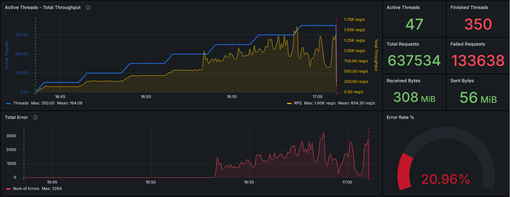
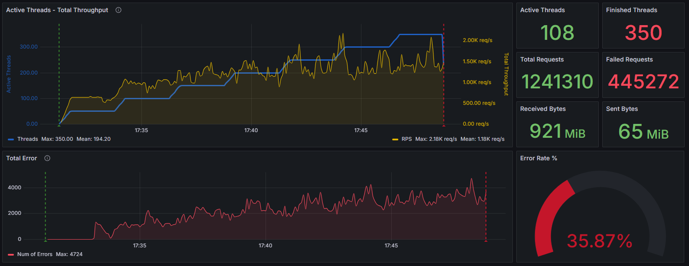
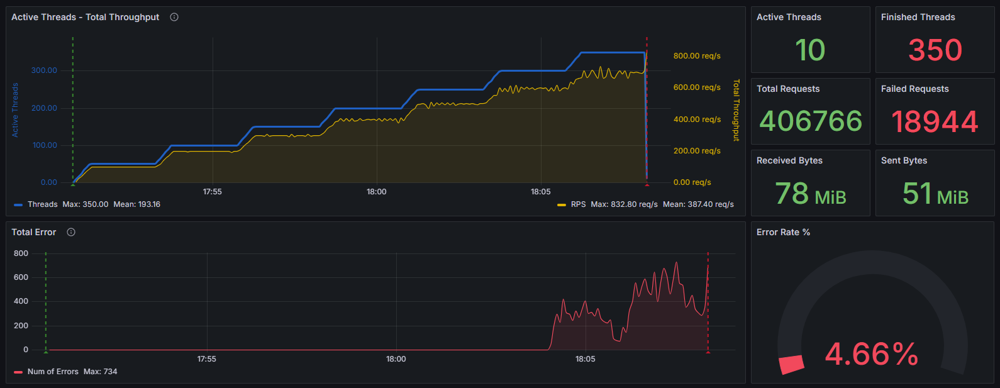
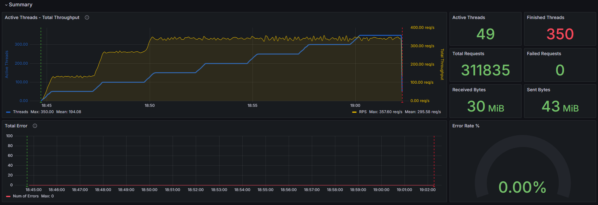
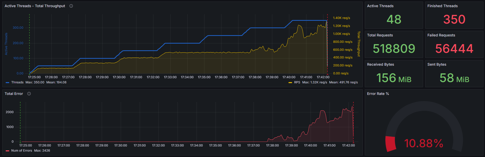
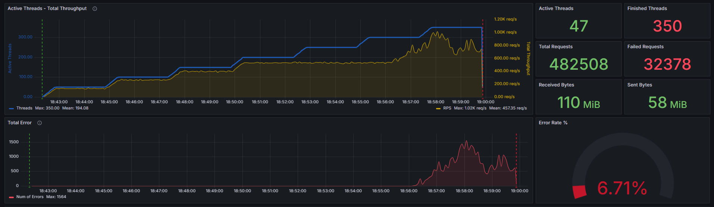

# Part 1 Заглушка

- На java написал заглушку. Использовал Spring Framework.
- Познакомился с приложением Fiddler Classic.
- Написал коллекцию в Postman с двумя методами GET и POST.

## В JMeter

- Использовал JSON Assertion для проверки ответа на GET и POST запросы.
- Отправка метрик осуществляется с помощью **Backend listener** в **InfluxDB**.

**Spring** поддерживает три веб-сервера: tomcat, jetty и undertow. По умолчанию работает tomcat.
В **JVM** по умолчанию запускается сборщик мусора G1. С помощью параметра `-Xlog:gc` можно вывести логи, связанные с работой сборщика мусора. Для более тонкой настройки можно использовать различные параметры, например:

- `-Xlog:gc:file=gc.log` — направляет логи в файл gc.log.
- `-Xlog:gc=debug` — устанавливает уровень детализации логов на debug.

## Графики тестов

Далее идут графики со ступенчатыми тестами при настройках JVM и Spring по умолчанию.

 \
*Скриншот со ступенчатым тестом без задержек в методах заглушки*

 \
*Скриншот со ступенчатым тестом с задержкой в 1-2 секунды на метод POST*

 \
*Скриншот со ступенчатым тестом с Constant Timer в 0,3 секунды на метод GET*

 \
*Скриншот со ступенчатым тестом с Constant Timer в 2 секунды на метод POST*

Изменим сервер в Spring с **tomcat** на **undertow**. \
Изменение сервера положительно сказалось на производительности заглушки. На уровне 350 виртуальных пользователя время отклика составило 4.6 секунды. Ошибок практически не зафиксировано.

 \
*Скриншот со ступенчатым тестом с Constant Timer в 2 секунды на метод POST и сервером undertow*

 \
*Скриншот со ступенчатым тестом с задержкой в 1-2 секунды на метод POST и Serial GC*

 \
*Скриншот со ступенчатым тестом с задержкой в 1-2 секунды на метод POST и -Xmx40m -XX:MaxNewSize=10m*

В JVM можно использовать различные настройки для управления сборщиком мусора (GC). Вот некоторые из наиболее часто используемых параметров:

1. **Выбор алгоритма GC:**
    - `-XX:+UseSerialGC` — использование серийного сборщика мусора (подходит для однопоточных приложений).
    - `-XX:+UseParallelGC` — использование параллельного сборщика мусора (подходит для многопоточных приложений).
    - `-XX:+UseConcMarkSweepGC` (CMS) — использование сборщика мусора Concurrent Mark-Sweep.
    - `-XX:+UseG1GC` — использование сборщика мусора Garbage-First (G1), который является более современным и эффективным для большинства приложений.

2. **Настройка размеров памяти:**
    - `-Xms<size>` — начальный размер кучи. Например, `-Xms1g` установит начальный размер кучи в 1 ГБ.
    - `-Xmx<size>` — максимальный размер кучи. Например, `-Xmx4g` установит максимальный размер кучи в 4 ГБ.
    - `-XX:NewSize=<size>` — размер области Eden.
    - `-XX:MaxNewSize=<size>` — максимальный размер области Eden.

3. **Настройка параметров GC:**
    - `-XX:SurvivorRatio=<ratio>` — соотношение размеров областей Eden и Survivor.
    - `-XX:MaxTenuringThreshold=<threshold>` — максимальное количество повышений уровня перед перемещением объекта в старое поколение.
    - `-XX:ParallelGCThreads=<N>` — количество потоков, используемых для параллельной сборки мусора в области Eden.
    - `-XX:ConcGCThreads` — количество потоков, используемых для параллельной сборки мусора в области Survivor.

4. **Включение дополнительных функций:**
    - `-XX:+PrintGC` — печать информации о сборке мусора.
    - `-XX:+PrintGCDetails` — более детальная печать информации о сборке мусора.
    - `-XX:+PrintHeapAtGC` — печать состояния кучи перед и после сборки мусора.
    - `-XX:+PrintTenuringDistribution` — печать информации о распределении возраста объектов.

5. **Настройки для G1 GC:**
    - `-XX:MaxGCPauseMillis=<N>` — указание максимальной паузы GC, которую нужно стараться не превышать.
    - `-XX:InitiatingHeapOccupancyPercent=<N>` — процент заполнения кучи, при достижении которого начинается цикл GC.

6. Параметры для настройки времени отклика:

    - `-XX:MaxGCPauseMillis` — максимальное время паузы для сборки мусора.
    - `-XX:InitiatingHeapOccupancyPercent` — процент заполнения кучи, при котором начинается сборка мусора в старом поколении.

## Настройки по умолчанию JVM

```text
uint64_t MaxRAM                                   = 137438953472         {pd product} {default}
  size_t MetaspaceSize                            = 22020096             {минимальный размер Metaspace}
  size_t MaxMetaspaceSize                         = 18446744073709551615 {максимальный размер Metaspace}
  size_t MinHeapSize                              = 8388608              {минимальный размер кучи}
  size_t MaxHeapSize                              = 1870659584           {максимальный размер кучи}
    bool UseG1GC                                  = true                 {используется G1}
    uint InitiatingHeapOccupancyPercent           = 45                   {процент заполнения кучи}
   uintx MaxGCPauseMillis                         = 200                  {максимальное время паузы для сборки мусора}
    uint ConcGCThreads                            = 1                    {количество потоков для сборки в Survivor}
    uint ParallelGCThreads                        = 4                    {количество потоков для сборки в Eden}
  size_t NewSize                                  = 1363144              {размер области Eden}
  size_t MaxNewSize                               = 1121976320           {максимальный размер области Eden}
   uintx SurvivorRatio                            = 8                    {соотношение размеров областей Eden и Survivor}
```

B Grafana использовал дашборд <https://grafana.com/grafana/dashboards/21818-jmeter-dashboard-influxdb/>

Полезные ссылки:

[Java HotSpot VM Options](https://www.oracle.com/java/technologies/javase/vmoptions-jsp.html) \
[Ускорение Spring REST API на 200%](https://habr.com/ru/companies/maxilect/articles/896240/)
