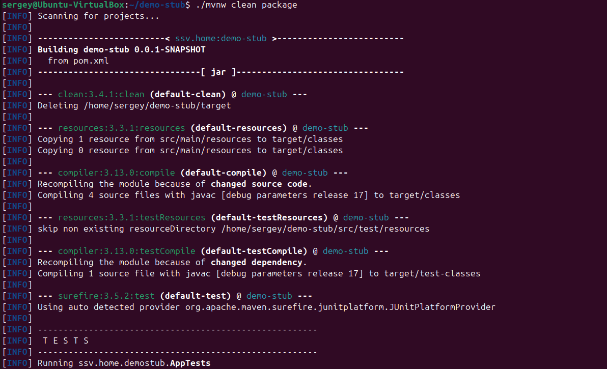
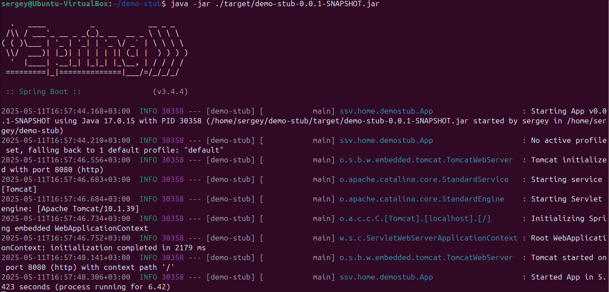
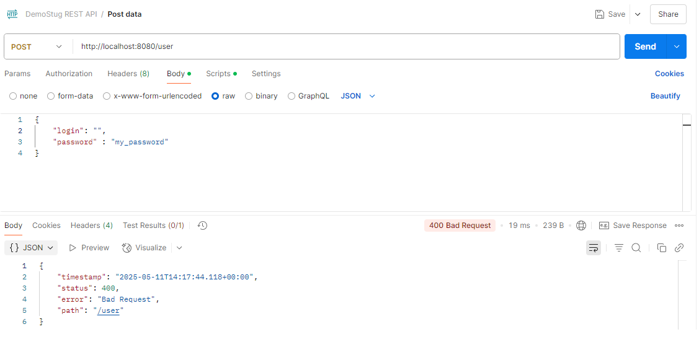
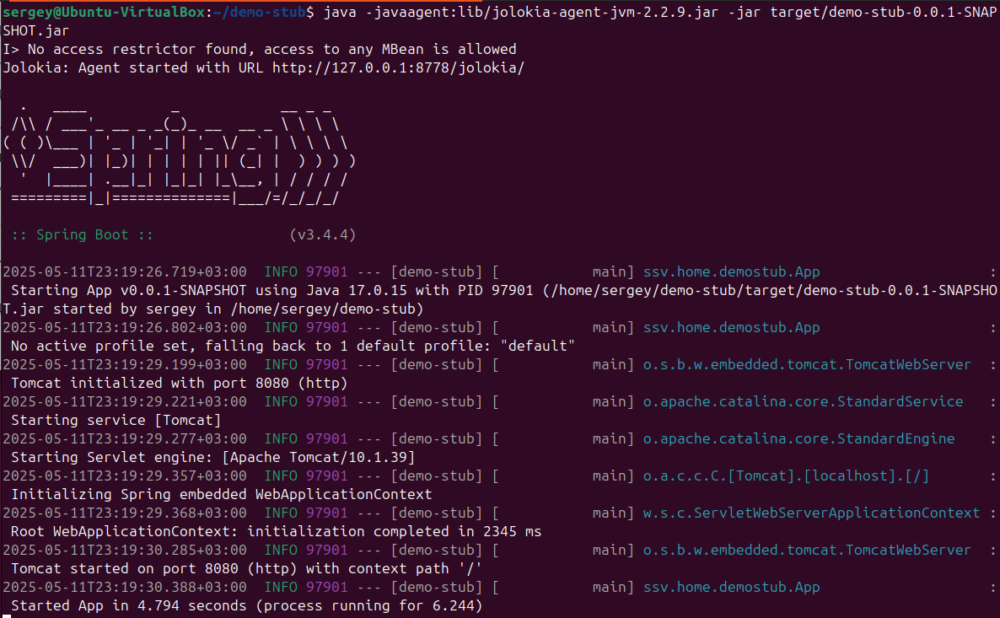
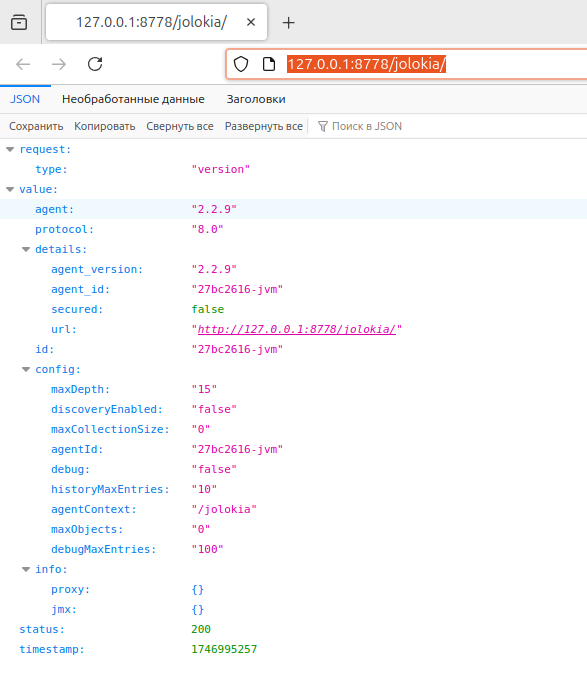
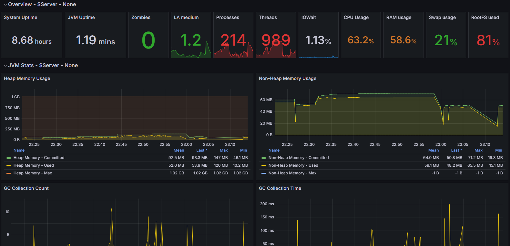

# Part 2 Метрики JVM

## Обработка исключений и валидация

Для валидации данных добавим зависимость в файл `pom.xml`.

```xml
     <dependency>
         <groupId>org.springframework.boot</groupId>
         <artifactId>spring-boot-starter-validation</artifactId>
         <version>${spring.version}</version>
     </dependency>
```

Для валидации данных, переданных в теле запроса, добавим аннотации к полям сущности `LoginDto`:

```java
public class LoginDto {

   @NotBlank
   private String login;

   @NotNull
   @Pattern(regexp = ".{8,}")
   private String password;

   private String date;
}
```

Поле `login` не должно быть пустым или равным null.
Поле `password` не должно быть равным null и должно содержать 8 или более символов.

Чтобы передать объект в валидатор, достаточно добавить аннотацию `@Valid` к параметру `dto`.
Выполнение метода контроллера начнется только после успешного прохождения всех проверок.

```java
@RestController
@RequestMapping("/user")
public class StubController {

   @PostMapping()
   public ResponseEntity<?> post(@Valid @RequestBody LoginDto dto) {
      try {
         Thread.sleep(getDelayTime());
      } catch (InterruptedException e) {
         return new ResponseEntity<>(HttpStatus.INTERNAL_SERVER_ERROR);
      }
      String currentDate = LocalDateTime.now().format(DateTimeFormatter.ofPattern("yyyy-MM-dd HH:mm:ss"));
      dto.setDate(currentDate);

      return new ResponseEntity<>(dto, HttpStatus.OK);
   }    
}
```

## Развернуть заглушку на виртуальной машине

Если на виртуальной машине не установлен Git, то с помощью команды `sudo apt install git` устанавливаем последнюю версию.

Далее с GitHub клонируем репозиторий командой `git clone https://github.com/SavushkinSV/demo-stub.git`.

 \
*Скриншот с клонированием проекта из репозитория*

Установим последнюю версию Java Runtime Environment (JRE) на виртуальную машину. Используем команду `sudo apt install openjdk-17-jre`.
Устанавливаем версию JRE в соответствии со свойствами, описанными в файле [pom.xml](../pom.xml).

Командой `./mvnw clean package` производим очистку и сборку проекта с упаковкой его в JAR-файл.

 \
*Скриншот со сборкой проекта*

После сборки с помощью команды `java -jar ./target/demo-stub-0.0.1-SNAPSHOT.jar` запускаем приложение.

 \
*Скриншот с запуском проекта на виртуальной машине*

Проверяем работу приложения при помощи **Postman** и **JMeter** с хоста.
При этом в настройках сети виртуальной машины делаем проброс порта `8080`.

 \
*Скриншот из Postman с некорректными данными в POST запросе*

## Добавить к приложению Jolokia agent

На официальном сайте Jolokia <https://jolokia.org/> скачаем последнюю версию агента (на текущий момент версия 2.2.9).
Скачанный файл поместим в директорию `/lib` проекта.

Теперь запустим приложение вместе с **Jolokia agent**. Для этого используем команду `java -javaagent:lib/jolokia-agent-jvm-2.2.9.jar -jar target/demo-stub-0.0.1-SNAPSHOT.jar`.

 \
*Скриншот запуска приложения с Jolokia agent на виртуальной машине*

Проверяем работу **Jolokia agent** в браузере по адресу `http://127.0.0.1:8778/jolokia`.

 \
*Скриншот браузера с проверкой работы Jolokia agent*

## Настройка Telegraf и Grafana под jolokia

Добавим блок конфигурации для jolokia в файл конфигурации **Telegraf** по адресу `/etc/telegraf/telegraf.conf`.

```ini
[[inputs.jolokia2_agent]]
urls = ["http://localhost:8080/jolokia"]

[[inputs.jolokia2_agent.metric]]
name  = "java_runtime"
mbean = "java.lang:type=Runtime"
paths = ["Uptime"]

[[inputs.jolokia2_agent.metric]]
name  = "java_memory"
mbean = "java.lang:type=Memory"
paths = ["HeapMemoryUsage", "NonHeapMemoryUsage", "ObjectPendingFinalizationCount"]

[[inputs.jolokia2_agent.metric]]
name     = "java_garbage_collector"
mbean    = "java.lang:name=*,type=GarbageCollector"
paths    = ["CollectionTime", "CollectionCount"]
tag_keys = ["name"]

[[inputs.jolokia2_agent.metric]]
name  = "java_last_garbage_collection"
mbean = "java.lang:name=*,type=GarbageCollector"
paths = ["LastGcInfo"]
tag_keys = ["name"]

[[inputs.jolokia2_agent.metric]]
name  = "java_threading"
mbean = "java.lang:type=Threading"
paths = ["TotalStartedThreadCount", "ThreadCount", "DaemonThreadCount", "PeakThreadCount"]

[[inputs.jolokia2_agent.metric]]
name  = "java_class_loading"
mbean = "java.lang:type=ClassLoading"
paths = ["LoadedClassCount", "UnloadedClassCount", "TotalLoadedClassCount"]

[[inputs.jolokia2_agent.metric]]
name     = "java_memory_pool"
mbean    = "java.lang:name=*,type=MemoryPool"
paths    = ["Usage", "PeakUsage", "CollectionUsage"]
tag_keys = ["name"]
```

С помощью команды `sudo systemctl restart telegraf.service` перезапустим сервис с новыми настройками.

В **Grafana** добавим новый дашборд <https://grafana.com/grafana/dashboards/8991-jvm-metrics-jolokia-2/> для просмотра метрик JVM.

 \
*Скриншот визуализации метрик JVM в Grafana*

С помощью **Jolokia Agent** и **Telegraf** можно получить следующие метрики JVM и Garbage Collector (GC):

**JVM метрики:**

* `jvm.uptime` — время работы JVM;
* `jvm.start_time` — время запуска JVM;
* `jvm.version` — версия JVM;
* `jvm.name` — название JVM;
* `jvm.vendor` — поставщик JVM;
* `jvm.threads.count` — количество потоков в JVM;
* `jvm.threads.peak_count` — максимальное количество потоков, которое было в JVM;
* `jvm.memory.heap.init` — начальный размер кучи;
* `jvm.memory.heap.used` — используемый размер кучи;
* `jvm.memory.heap.committed` — подтверждённый размер кучи;
* `jvm.memory.heap.max` — максимальный размер кучи;
* `jvm.memory.non_heap.init` — начальный размер некучевых данных;
* `jvm.memory.non_heap.used` — используемый размер некучевых данных;
* `jvm.memory.non_heap.committed` — подтверждённый размер некучевых данных;
* `jvm.memory.non_heap.max` — максимальный размер некучевых данных.

**GC метрики:**

* `gc.collection_count` — количество коллекций GC;
* `gc.collection_time` — время, затраченное на коллекции GC;
* `gc.memory.used` — объём памяти, используемый после сбора мусора;
* `gc.memory.allocated` — объём выделенной памяти;
* `gc.memory.wasted` — объём потерянной памяти (неиспользуемая память между коллекциями).

Полезные ссылки:

[Валидация данных в Spring Boot](https://struchkov.dev/blog/ru/spring-boot-validation/) \
[Jolokia2 Agent Input Plugin](https://github.com/influxdata/telegraf/blob/master/plugins/inputs/jolokia2_agent/README.md) \
[java.conf](https://github.com/influxdata/telegraf/blob/master/plugins/inputs/jolokia2_agent/examples/java.conf)
