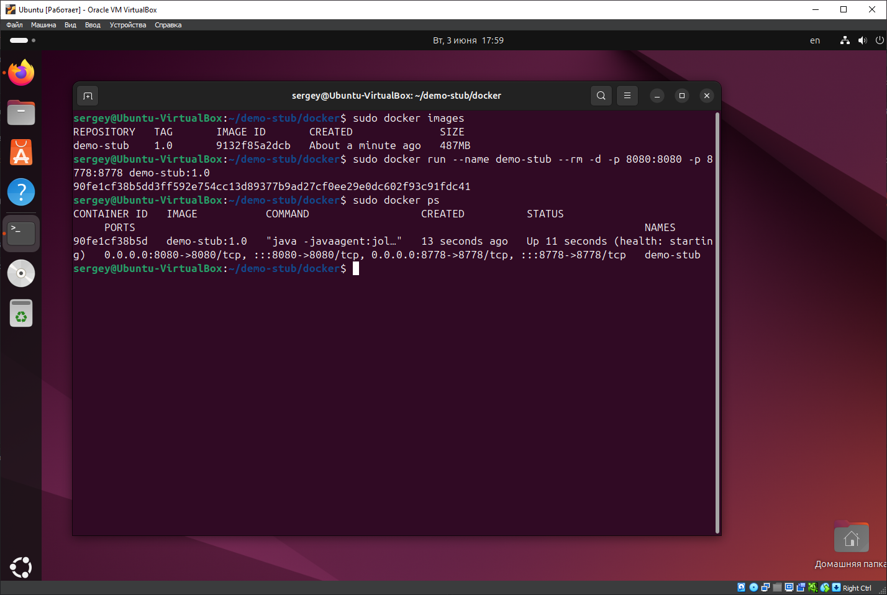

# Part 3 Docker

## Создание Dockerfile

Создадим в директории `./docker/` проекта файл [Dockerfile](../docker/Dockerfile) для создания образа. Содержимое файла приведено ниже.

```dockerfile
FROM maven:3.8.3-openjdk-17 AS build
WORKDIR /build
RUN git clone https://github.com/SavushkinSV/demo-stub.git . && \
    mvn clean package
FROM openjdk:17-jdk-slim
RUN useradd -ms /bin/bash stub
WORKDIR /app
COPY --from=build /build/target/demo-stub-0.0.1-SNAPSHOT.jar ./demo-stub.jar
COPY --from=build /build/lib/jolokia-agent-jvm-2.2.9.jar ./jolokia-agent-jvm-2.2.9.jar
HEALTHCHECK --interval=5s --timeout=10s --retries=3 \
    CMD curl -f http://localhost/ || exit 1
EXPOSE 8080 8778
USER stub
CMD ["java", "-javaagent:jolokia-agent-jvm-2.2.9.jar=port=8778,host=0.0.0.0", "-jar", "demo-stub.jar"]
```

Соберём написанный докер-образ с помощью команды `docker build -t demo-stub:1.0 .`, при этом укажем имя образа **demo-stub** и тег **1.0**.

 \
*Скриншот с вызовом и выполнением команд*

С помощью команды `docker images` выведем в консоль все образы **Docker**.

 \
*Скриншот с вызовом и выполнением команд*

Проверим полученный докер образ с помощью утилиты **Dockle** на наличие уязвимостей. Выполним команду `dockle demo-stub:1.0`.
Уведомления уровней **FATAL** и **WARN** необходимо устранить.

 \
*Скриншот с вызовом и выполнением команд*

Командой `docker run --name demo-stub --rm -d -p 8080:8080 -p 8778:8778 demo-stub:1.0` запустим контейнер с именем **demo-stub** из образа **demo-stub:1.0**.
При вызове `docker run` используется следующие параметры:

* `--name demo-stub` — задаёт имя контейнера «demo-stub».
* `--rm` — удаляет контейнер после его остановки.
* `-d` — запускает контейнер в фоновом режиме.
* `-p 8080:8080` — сопоставляет порт 8080 хоста с портом 8080 контейнера.
* `-p 8778:8778` — сопоставляет порт 8778 хоста с портом 8778 контейнера.
* `demo-stub:1.0` — указывает образ, на основе которого будет запущен контейнер.

Командой `docker ps` проверим, что контейнер запущен.

 \
*Скриншот с вызовом и выполнением команд*

## Проверка работы контейнера Docker

Проверяем работу **Jolokia agent** с хоста в браузере по адресу `http://127.0.0.1:8778/jolokia/`.

 \
*Скриншот браузера с проверкой работы Jolokia agent*

Проверяем работу приложения с хоста при помощи **Postman**.

 \
*Скриншот из Postman с GET запросом*

Подключимся к **Grafana** с хоста по адресу `http://localhost:3000/` и проверим отображение JVM метрик в docker контейнере.
На хосте запущен JMeter со скриптом нагрузки на заглушку.

 \
*Скриншот дашборда Grafana с метриками JVM в docker контейнере*

На виртуальной машине просмотрим логи запуска контейнера командой `docker logs demo-stub`. На скриншоте видно вывод в консоль сообщений **Spring**.

 \
*Скриншот с вызовом и выполнением команд*
