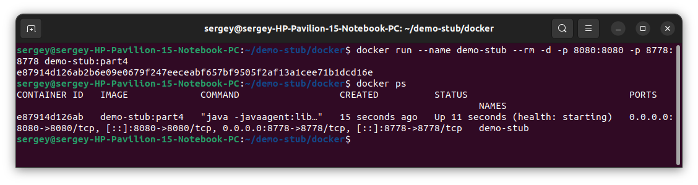
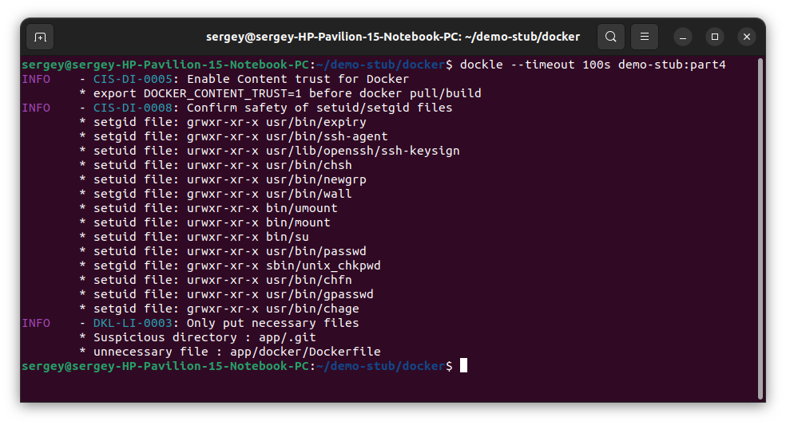
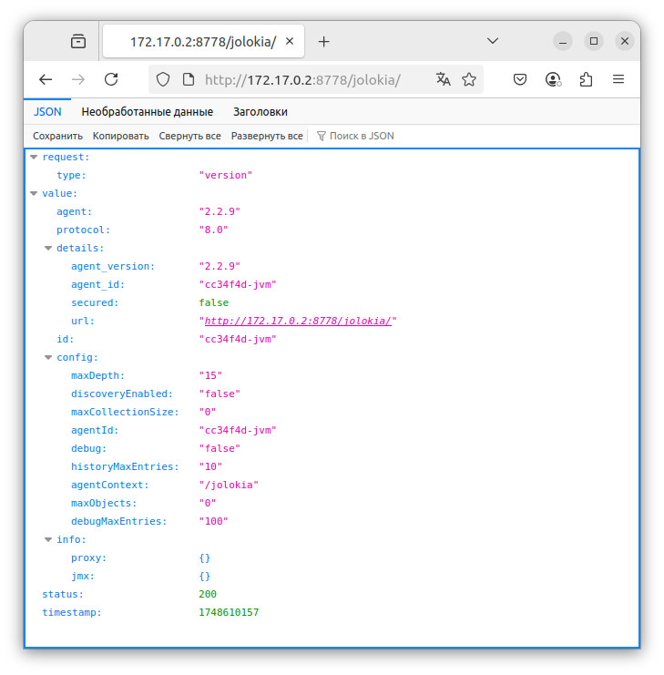

## Part 4 Part 4 Docker

### 3.1 Создание Dockerfile

Создадим в директории `./docker/` проекта файл [Dockerfile](../docker/Dockerfile) для создания образа. Содержимое файла приведено ниже.

```dockerfile
FROM openjdk:17-jdk-slim
RUN apt-get update && \
    apt-get install -y wget && \
    rm -rf /var/lib/apt/lists/*
RUN apt-get update && \
    apt-get install -y git && \
    apt-get install -y --no-install-recommends maven && \
    rm -rf /var/lib/apt/lists/*
RUN useradd -ms /bin/bash stub    
HEALTHCHECK --interval=5s --timeout=10s --retries=3 \
    CMD curl -f http://localhost/ || exit 1
WORKDIR /app
RUN git clone https://github.com/SavushkinSV/demo-stub.git /app
RUN mvn clean install
EXPOSE 8080
USER stub
CMD ["java", "-javaagent:lib/jolokia-agent-jvm-2.2.9.jar", "-jar", "target/demo-stub-0.0.1-SNAPSHOT.jar"]
```

Соберём написанный докер-образ с помощью команды docker `docker build -t demo-stub:part4 .`, при этом указав имя **demo-stub** и тег **part4**.
С помощью команды `docker images` выведем в консоль все образы **Docker**.

 \
*Скриншот с вызовом и выполнением команд*

Проверим с помощью утилиты **Dockle** на наличие уязвимостей. Выполним команду `dockle demo-stub:part4`.
Уведомления уровней **FATAL** и **WARN** необходимо устранить.

 \
*Скриншот с вызовом и выполнением команд*

Командой `docker run --name demo-stub -d -p 8080:8080 demo-stub:part4` запустим контейнер с именем **demo-stub** из образа **demo-stub:part4**.
Командой `docker ps` проверим, что контейнер запущен.

 \
*Скриншот с вызовом и выполнением команд*

Проверяем работу приложения при помощи **Postman** с хоста.

 \
*Скриншот из Postman с GET запросом*
