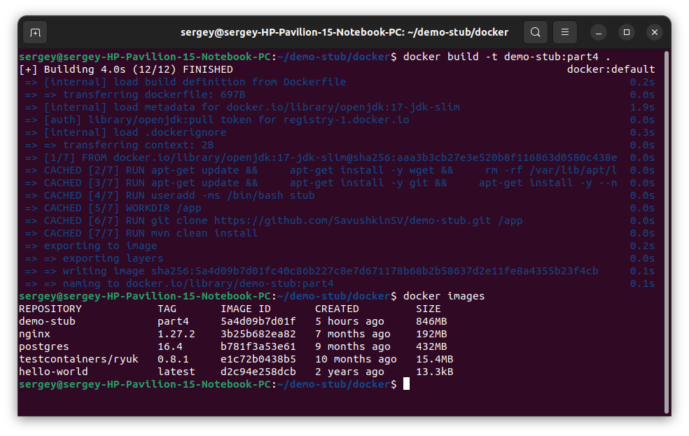
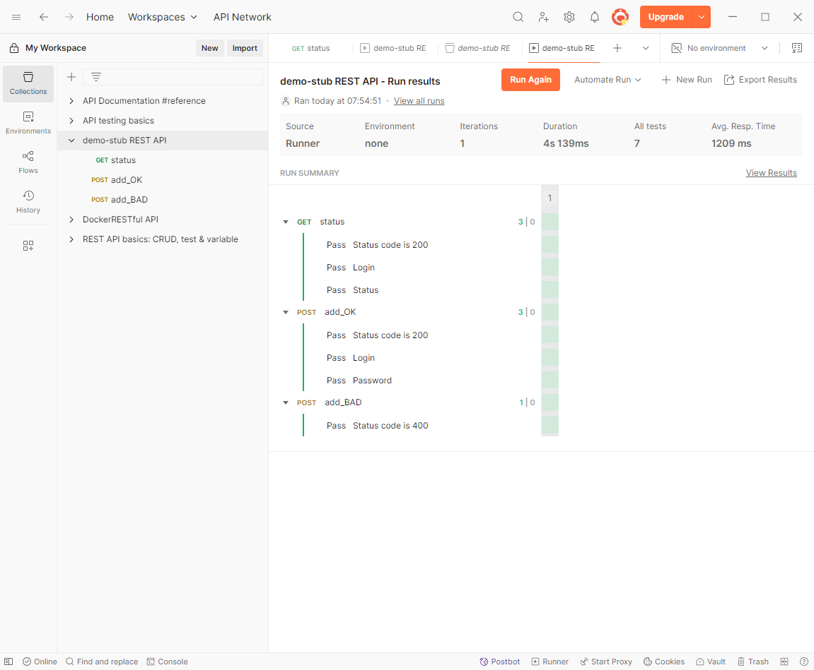
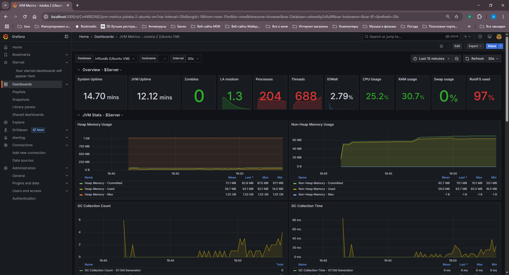
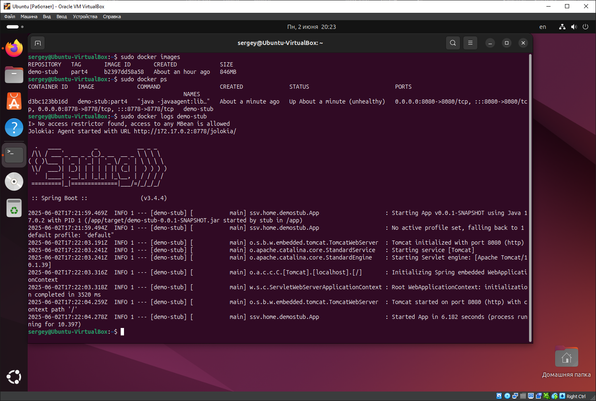

## Part 4 Part 4 Docker

### 3.1 Создание Dockerfile

Создадим в директории `./docker/` проекта файл [Dockerfile](../docker/Dockerfile) для создания образа. Содержимое файла приведено ниже.

```dockerfile
FROM openjdk:17-jdk-slim
RUN apt-get update && \
    apt-get install -y wget && \
    apt-get install -y git && \
    apt-get install -y --no-install-recommends maven && \
    useradd -ms /bin/bash stub && \
    rm -rf /var/lib/apt/lists/*    
HEALTHCHECK --interval=5s --timeout=10s --retries=3 \
    CMD curl -f http://localhost/ || exit 1
WORKDIR /app
RUN git clone https://github.com/SavushkinSV/demo-stub.git /app && \
    mvn clean install
EXPOSE 8080 8778
USER stub
CMD ["java", "-javaagent:lib/jolokia-agent-jvm-2.2.9.jar=port=8778,host=0.0.0.0", "-jar", "target/demo-stub-0.0.1-SNAPSHOT.jar"]
```

Соберём написанный докер-образ с помощью команды `docker build -t demo-stub:part4 .`, при этом укажем имя образа **demo-stub** и тег **part4**. С помощью команды `docker images` выведем в консоль все образы **Docker**.

 \
*Скриншот с вызовом и выполнением команд*

Проверим полученный докер образ с помощью утилиты **Dockle** на наличие уязвимостей. Выполним команду `dockle demo-stub:part4`.
Уведомления уровней **FATAL** и **WARN** необходимо устранить.

 \
*Скриншот с вызовом и выполнением команд*

Командой `docker run --name demo-stub --rm -d -p 8080:8080 -p 8778:8778 demo-stub:part4` запустим контейнер с именем **demo-stub** из образа **demo-stub:part4**.
При вызове `docker run` используется следующие параметры:

* `--name demo-stub` — задаёт имя контейнера «demo-stub».
* `--rm` — удаляет контейнер после его остановки.
* `-d` — запускает контейнер в фоновом режиме.
* `-p 8080:8080` — сопоставляет порт 8080 хоста с портом 8080 контейнера.
* `-p 8778:8778` — сопоставляет порт 8778 хоста с портом 8778 контейнера.
* `demo-stub:part4` — указывает образ, на основе которого будет запущен контейнер.

Командой `docker ps` проверим, что контейнер запущен.

 \
*Скриншот с вызовом и выполнением команд*

Проверяем работу **Jolokia agent** в браузере по адресу `http://172.17.0.2:8778/jolokia/`. Просматривается на ip адресе контейнера.

 \
*Скриншот браузера с проверкой работы Jolokia agent*

Проверяем работу приложения при помощи **Postman** с хоста.

 \
*Скриншот из Postman с GET запросом*

Подключимся к **Grafana** с хоста по адресу `http://localhost:3000/` и проверим отображение JVM метрик в docker контейнере.
На хосте запущен JMeter со скриптом нагрузки на заглушку.

 \
*Скриншот дашборда Grafana с метриками JVM в docker контейнере*

На виртуальной машине просмотрим логи запуска контейнера командой `docker logs demo-stub`. На скриншоте видно вывод в консоль сообщений **Spring**.

 \
*Скриншот с вызовом и выполнением команд*
